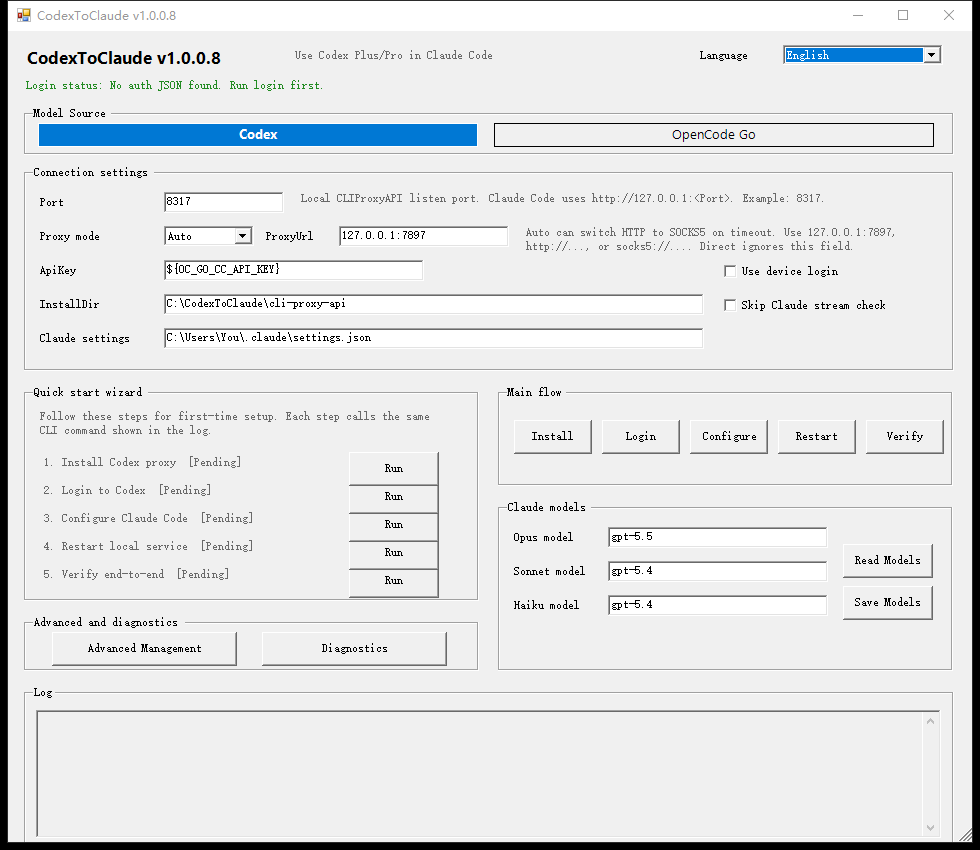
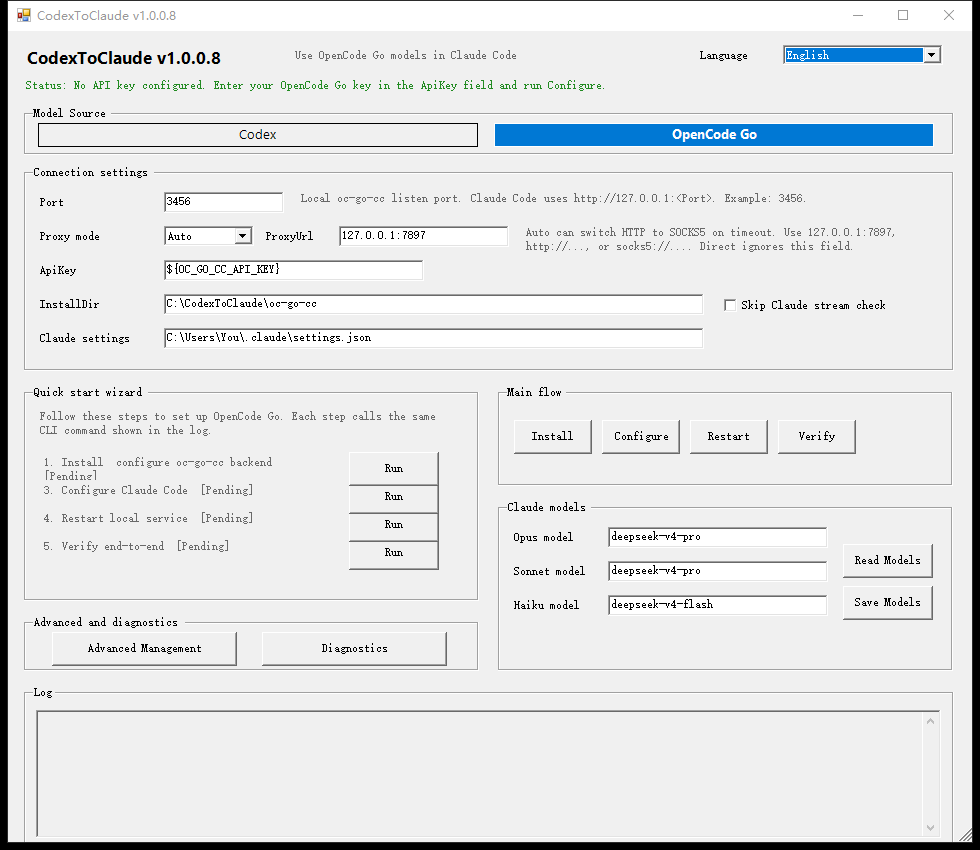
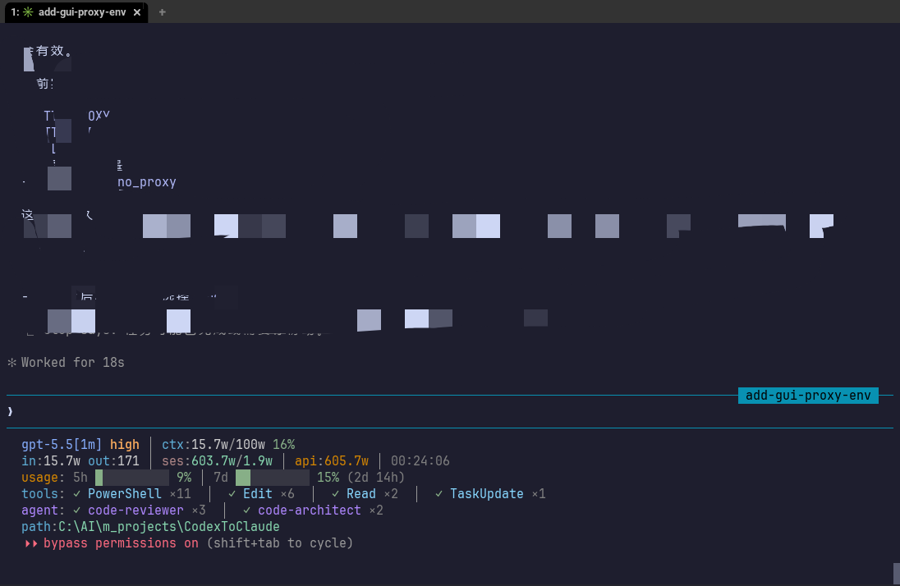

# CodexToClaude

> Turn Codex Plus/Pro and OpenCode Go into a local Anthropic-compatible API for Claude Code.

<p align="center">
  <strong>📖 Documentation:</strong>
  <a href="./README.md"><strong>English</strong></a>
  &nbsp;|&nbsp;
  <a href="./README.zh-CN.md"><strong>中文文档</strong></a>
</p>

<p align="center">
  <a href="./README.md"></a>
  <a href="./README.zh-CN.md"></a>
  <a href="https://learn.microsoft.com/en-us/powershell/"></a>
  <a href="./LICENSE"></a>
  <a href="./VERSION"></a>
</p>

## Preface

While using cc-switch and other similar projects, I noticed that they still have certain compatibility issues when translating and adapting the GPT protocol. These issues can cause request errors, unexpected responses, or unstable behavior when used with Claude Code.The goal of this project is to address these pain points and provide a more stable and accurate protocol adaptation solution, enabling Codex Plus/Pro and other GPT subscription plans to be used properly and smoothly within Claude Code.

CodexToClaude is a Windows-first local proxy setup tool. It installs, configures, starts, and verifies backend proxies, then points Claude Code at your local Anthropic-compatible endpoint.

```text
Claude Code -> http://127.0.0.1:<Port> -> CLIProxyAPI -> Codex OAuth -> Codex models
                                     \-> oc-go-cc    -> OpenCode Go models
```

## 🎯 Who is this for?

- You have Codex Plus/Pro and want to use Codex models from Claude Code.
- You have an OpenCode Go API key and want to use OpenCode Go models from Claude Code.
- You do not want to manually maintain proxy config files, Claude Code `settings.json`, startup commands, and verification steps.

## ✨ Highlights

- 🚀 **Guided GUI setup** — Double-click `CodexToClaude-GUI.cmd` and follow the wizard: install, login, configure, restart, verify.
- 🔀 **Two model sources** — Switch between Codex and OpenCode Go from one UI without duplicating setup logic.
- 🧩 **Claude Code auto-config** — Merges only target `env` values into `~/.claude/settings.json`, preserving statusLine, permissions, language, and other settings.
- 🗜️ **Optional auto-compact thresholds** — `configure` can explicitly write or remove Claude Code auto-compact env overrides for proxy models whose context window is misdetected.
- 📊 **Usage limits in status line** — Recommended with [`cc-statusline`](https://github.com/shuiyu486/terr-marketplace/tree/main/plugins/cc-statusline), which reads CodexToClaude's forwarded `X-Codex-*` headers and shows 5h/7d usage limits.
- 🌐 **Proxy modes built in** — Supports `Auto`, `Http`, `Socks5`, and `Direct`; `Auto` can switch between HTTP and SOCKS5 after timeout-style failures.
- 🧪 **End-to-end verification** — Checks `/v1/models`, `/v1/messages`, and Claude Code stream-json.
- 🛟 **Hang recovery watchdog** — Restarts CLIProxyAPI when a `/v1/messages` request runs longer than 5 minutes; in `Auto` mode, repeated HTTP/SOCKS5 stalls are scored so the less failure-prone scheme is pinned temporarily. Explicit `Http`, `Socks5`, and `Direct` modes never auto-switch.
- 🔌 **Codex WebSocket auth tagging** — Ensures enabled Codex OAuth JSON has `websockets: true` when missing, while preserving explicit values.
- 🧭 **Local proxy bypass** — Writes `NO_PROXY` / `no_proxy` for the local provider URL so Claude Code does not send `127.0.0.1:<Port>` traffic through your system proxy.
- 🖥️ **Command-line proxy env** — The diagnostics tools can write the current proxy config to User-scope `HTTP_PROXY` / `HTTPS_PROXY` / `ALL_PROXY` for new cmd, PowerShell, and Git Bash sessions, without changing Windows system proxy or WinHTTP.
- 📦 **Version management** — View and update the project and provider binaries from either the GUI or CLI.
- 🔐 **Safe defaults** — OAuth JSON, tokens, API keys, and logs are git-ignored, and scripts do not print real secrets.

## 🖼️ Screenshots

Codex backend:



OpenCode Go backend:



## 📋 Requirements

| Requirement | Notes |
|-------------|-------|
| Windows / PowerShell 5.1+ | Primary supported environment. |
| Claude Code | CLI, desktop app, and IDE extensions are all supported. |
| Codex Plus/Pro or OpenCode Go API key | Pick either backend. |
| Git for Windows | Recommended for project updates; downloading a ZIP also works. |
| Network access to the upstream service | If you need a proxy, prepare a proxy address such as `127.0.0.1:7897`. |

Decide these values before setup:

| Name | Recommended value | Notes |
|------|-------------------|-------|
| `Port` | Codex: `8317`; OpenCode Go: `3456` | Local port used by Claude Code. |
| `ProxyMode` | `Auto` | Starts with HTTP proxy config and may retry with SOCKS5 when needed. |
| `ProxyUrl` | `127.0.0.1:7897` | Required for `Auto` / `Http` / `Socks5`; choose `Direct` for no proxy. |
| `CodexUserAgent` | Built-in Codex CLI compatible UA | Optional CLI-only fallback for Codex OAuth upstream requests; normally leave it unchanged. |
| `AutoCompact` | `Unset` | Optional CLI/GUI setting. `Unset` leaves existing Claude Code auto-compact env untouched, `Enabled` writes `Window` + `Pct`, and `Disabled` removes those overrides. |

If you do not need a proxy, explicitly choose `Direct`; do not leave `ProxyUrl` empty and expect it to mean direct access.

## 🚀 GUI installation guide

### 1. Download the project

Choose one option:

```powershell
# Option A: clone with Git
cd C:\Tools
git clone <your-codextoclaude-repo-url> CodexToClaude
cd .\CodexToClaude
```

Or download the project ZIP and extract it, for example:

```text
C:\Tools\CodexToClaude
```

If Windows blocks script execution, run this from the project directory:

```powershell
Unblock-File .\CodexToClaude-GUI.cmd
Unblock-File .\scripts\*.ps1
Unblock-File .\scripts\providers\*.ps1
```

### 2. Open the GUI

Double-click:

```text
CodexToClaude-GUI.cmd
```

Or run it from PowerShell:

```powershell
.\CodexToClaude-GUI.cmd
```

### 3. Choose a model source

Use the `Model Source` buttons at the top:

| Choice | Use it when |
|--------|-------------|
| `Codex` | You have Codex Plus/Pro and need OAuth login. |
| `OpenCode Go` | You have an OpenCode Go API key and do not need OAuth login. |

### 4. Fill in connection settings

Good starting values:

| Field | Codex example | OpenCode Go example |
|-------|---------------|---------------------|
| Port | `8317` | `3456` |
| Proxy mode | `Auto` | `Auto` |
| ProxyUrl | `127.0.0.1:7897` | `127.0.0.1:7897` |
| ApiKey | Keep the local placeholder | `${OC_GO_CC_API_KEY}` or your OpenCode Go API key |
| InstallDir | `C:\CodexToClaude\cli-proxy-api` | `C:\CodexToClaude\oc-go-cc` |
| Claude settings | `C:\Users\You\.claude\settings.json` | Same |

If your network can access the upstream service directly, change `Proxy mode` to `Direct`; the proxy address will be ignored.

### 5. Run the quick start wizard

#### Codex backend

Click these steps in order:

```text
Install Codex proxy -> Login to Codex -> Configure Claude Code -> Restart local service -> Verify end-to-end
```

Login opens a browser. If browser login is inconvenient, enable `Use device login` before clicking `Login`; the device code and verification URL are streamed into the GUI log while the login process waits.

#### OpenCode Go backend

Click these steps in order:

```text
Install & configure oc-go-cc backend -> Configure Claude Code -> Restart local service -> Verify end-to-end
```

OpenCode Go does not use OAuth. The recommended setup is to store your key in `OC_GO_CC_API_KEY` and keep `${OC_GO_CC_API_KEY}` in the GUI field.

### 6. Verify success

After `Verify` succeeds, Claude Code will use the local backend URL:

```text
http://127.0.0.1:8317   # Codex
http://127.0.0.1:3456   # OpenCode Go
```

Restart Claude Code, then use the configured Opus / Sonnet / Haiku model names.

## 🖥️ CLI installation guide

Prefer the terminal? You can skip the GUI.

### First-time Codex setup

```powershell
.\scripts\CodexToClaude.ps1 install -Provider cliproxy -Port 8317 -ProxyMode Auto -ProxyUrl "127.0.0.1:7897"
.\scripts\CodexToClaude.ps1 login -Provider cliproxy
.\scripts\CodexToClaude.ps1 configure -Provider cliproxy -Port 8317 -ProxyMode Auto -ProxyUrl "127.0.0.1:7897"
.\scripts\CodexToClaude.ps1 restart -Provider cliproxy
.\scripts\CodexToClaude.ps1 verify -Provider cliproxy
```

Device login:

```powershell
.\scripts\CodexToClaude.ps1 login -Provider cliproxy -Device
```

### First-time OpenCode Go setup

```powershell
$env:OC_GO_CC_API_KEY = "your OpenCode Go API key"
.\scripts\CodexToClaude.ps1 install -Provider occ -Port 3456 -ProxyMode Auto -ProxyUrl "127.0.0.1:7897"
.\scripts\CodexToClaude.ps1 configure -Provider occ -Port 3456 -ProxyMode Auto -ProxyUrl "127.0.0.1:7897"
.\scripts\CodexToClaude.ps1 restart -Provider occ
.\scripts\CodexToClaude.ps1 verify -Provider occ
```

### Direct network access

```powershell
.\scripts\CodexToClaude.ps1 install -Port 8317 -ProxyMode Direct
.\scripts\CodexToClaude.ps1 configure -Port 8317 -ProxyMode Direct
.\scripts\CodexToClaude.ps1 restart
.\scripts\CodexToClaude.ps1 verify
```

Legacy shortcuts are still accepted: `-ProxyUrl none` / `-ProxyUrl direct` are normalized to direct mode.

### Optional Claude Code auto-compact thresholds

If Claude Code misdetects a proxy model's context window, explicitly configure auto-compact overrides during `configure`:

```powershell
.\scripts\CodexToClaude.ps1 configure -Provider cliproxy -Port 8317 -ProxyMode Auto -ProxyUrl "127.0.0.1:7897" -AutoCompact Enabled -AutoCompactWindow 120000 -AutoCompactPct 70
```

`Enabled` requires both values. `Disabled` removes `CLAUDE_CODE_AUTO_COMPACT_WINDOW` and `CLAUDE_AUTOCOMPACT_PCT_OVERRIDE`; `Unset` leaves any existing values untouched. The actual compact timing is still approximate and controlled by Claude Code.

GUI note: the GUI field is `Context window (K tokens)`, so enter `120` to send `120000` raw tokens to the CLI/env. Existing GUI preferences are not migrated automatically; if an old saved value still shows `120000`, edit it manually to `120`.

## ⚙️ Common commands

```powershell
# Status
.\scripts\CodexToClaude.ps1 status
.\scripts\CodexToClaude.ps1 auth-status

# Full diagnostics
.\scripts\CodexToClaude.ps1 doctor

# Optional advanced compatibility checks
.\scripts\CodexToClaude.ps1 verify -CheckToolSearch

# Start / stop service
.\scripts\CodexToClaude.ps1 start
.\scripts\CodexToClaude.ps1 stop
.\scripts\CodexToClaude.ps1 restart

# View / update the project
.\scripts\CodexToClaude.ps1 project-version
.\scripts\CodexToClaude.ps1 project-update

# View / update the current provider binary
.\scripts\CodexToClaude.ps1 cliproxy-version
.\scripts\CodexToClaude.ps1 cliproxy-update

# View / change Claude Code model mapping
.\scripts\CodexToClaude.ps1 models
.\scripts\CodexToClaude.ps1 configure-models -OpusModel "gpt-5.5" -SonnetModel "gpt-5.4" -HaikuModel "gpt-5.4"
```

## 📁 Files and directories

CodexToClaude may create or update these files:

| Path | Purpose |
|------|---------|
| `<repo-root>\cli-proxy-api\config.yaml` | CLIProxyAPI config. |
| `<repo-root>\cli-proxy-api\cli-proxy-api.exe` | CLIProxyAPI executable. |
| `<repo-root>\cli-proxy-api\codex-*.json` | Codex OAuth login files, git-ignored. |
| `<repo-root>\cli-proxy-api\codextoclaude-state\watchdog-state.json` | CodexToClaude watchdog Auto proxy state; kept outside the auth-dir root to avoid credential scan noise. |
| `<repo-root>\oc-go-cc\config.json` | oc-go-cc config. |
| `<repo-root>\oc-go-cc\oc-go-cc.exe` | oc-go-cc executable. |
| `~\.claude\settings.json` | Claude Code environment configuration. |

Project layout:

```text
CodexToClaude/
├── CodexToClaude-GUI.cmd      # Double-click GUI launcher
├── scripts/
│   ├── CodexToClaude.ps1      # Main CLI entrypoint
│   ├── CodexToClaude.UI.ps1   # WinForms GUI
│   └── providers/
│       ├── cliproxy.ps1       # Codex / CLIProxyAPI provider
│       └── occ.ps1            # OpenCode Go / oc-go-cc provider
├── docs/
│   ├── assets/                # README screenshots
│   ├── claude-code-setup.md   # New-machine setup notes
│   ├── project-guide.md       # Maintainer guide
│   └── 手动安装与使用.md       # Manual setup reference
├── test/
│   └── Test-CodexToClaude.ps1
├── VERSION
├── README.md
└── README.zh-CN.md
```

## 🧯 Troubleshooting

| Problem | What to try |
|---------|-------------|
| GUI does not open | Run `Unblock-File`, or start it with `powershell -ExecutionPolicy Bypass -File .\scripts\CodexToClaude.UI.ps1`. |
| Codex login fails | Check your proxy, rerun `install/configure`, try `login -Device`, then inspect `cli-proxy-api\logs\main.log`. CLIProxyAPI v7.1.61+ includes Codex backend request IDs there when `debug` and file logging are enabled. |
| OpenCode Go says no API key | Set `OC_GO_CC_API_KEY`, or enter the key in the GUI and click `Configure`. |
| `verify` times out or reports TLS errors | `ProxyMode Auto` can retry with SOCKS5; Codex auth JSON is tagged with `websockets: true` when missing. If repeated `/v1/messages?beta=true` calls still timeout, use `Socks5` explicitly and keep the watchdog enabled. Explicit `Socks5` stays pinned; watchdog restarts hung requests but does not switch it back to HTTP. |
| `verify` returns 403 / forbidden and the error log contains `Enable JavaScript and cookies to continue` | `chatgpt.com/backend-api/codex/responses` returned a Cloudflare challenge. The generated config now writes `codex-header-defaults.user-agent` as a Codex OAuth upstream UA fallback; if it still fails, the current network or proxy exit is likely risk-blocked. Try a different proxy exit or network, then rerun `Configure` + `Restart` + `Verify`. |
| Claude Code reports socket closed or local proxy 502 | Run `Configure` again so `NO_PROXY` / `no_proxy` includes `127.0.0.1:<Port>`, then restart Claude Code. Fast upstream 5xx responses are retried by Claude Code; the watchdog only restarts requests stuck for 5 minutes, so normal long reasoning streams are not killed early. |
| Claude Code still uses old models | Click `Configure`, click `Restart`, then restart Claude Code. |
| Port is already in use | Pick another port, then rerun `Configure` + `Restart` + `Verify`. |

## 📊 Usage limit status line

The Codex backend enables `passthrough-headers: true` in CLIProxyAPI config, forwarding upstream `X-Codex-Primary-*` and `X-Codex-Secondary-*` limit headers to Claude Code clients.

A compatible status line plugin can use those headers to show:

- Primary usage window, usually around 5 hours.
- Secondary usage window, usually around 7 days.
- Reset countdowns.

Recommended companion plugin: [`cc-statusline`](https://github.com/shuiyu486/terr-marketplace/tree/main/plugins/cc-statusline), which reads CodexToClaude's forwarded `X-Codex-*` headers and shows the 5h/7d usage limits in your Claude Code status line.



CodexToClaude only forwards headers; rendering usage limits is handled by your status line plugin.

## 💭 About thinking output

CodexToClaude passes `reasoning` / `reasoning.effort` / `thinking` through to CLIProxyAPI by default, so the backend can follow the current Claude Code `/effort` or `effortLevel` instead of a hard-coded max effort.

If Codex thinking streams cause duplicated characters, very long thinking output, or other TUI display issues, you can manually add this compatibility filter to `cli-proxy-api/config.yaml` and restart CodexToClaude. This disables those thinking-related request fields for matching Codex models.

```yaml
payload:
  filter:
    - models:
        - name: "gpt-*"
          protocol: "codex"
      params:
        - "reasoning"
        - "reasoning.effort"
        - "thinking"
```

## 🛡️ Security notes

Do not commit or publish:

- Codex OAuth JSON.
- `access_token`, `refresh_token`, or `id_token`.
- Real OpenCode Go API keys.
- Log files.

Before committing, check:

```powershell
git status
git diff
```

## 🧪 Development and tests

```powershell
# Automated tests
.\test\Test-CodexToClaude.ps1

# Real environment acceptance check
.\scripts\CodexToClaude.ps1 restart
.\scripts\CodexToClaude.ps1 verify
.\scripts\CodexToClaude.ps1 verify -CheckToolSearch
```

For maintainer details, see [`docs/project-guide.md`](docs/project-guide.md).

## 🔗 Upstream projects

CodexToClaude builds on these open-source projects:

- [CLIProxyAPI](https://github.com/router-for-me/CLIProxyAPI): local Anthropic-compatible API and Codex OAuth proxy conversion.
- [oc-go-cc](https://github.com/samueltuyizere/oc-go-cc): Anthropic / OpenAI format conversion proxy for OpenCode Go.

## 📄 License

MIT License
