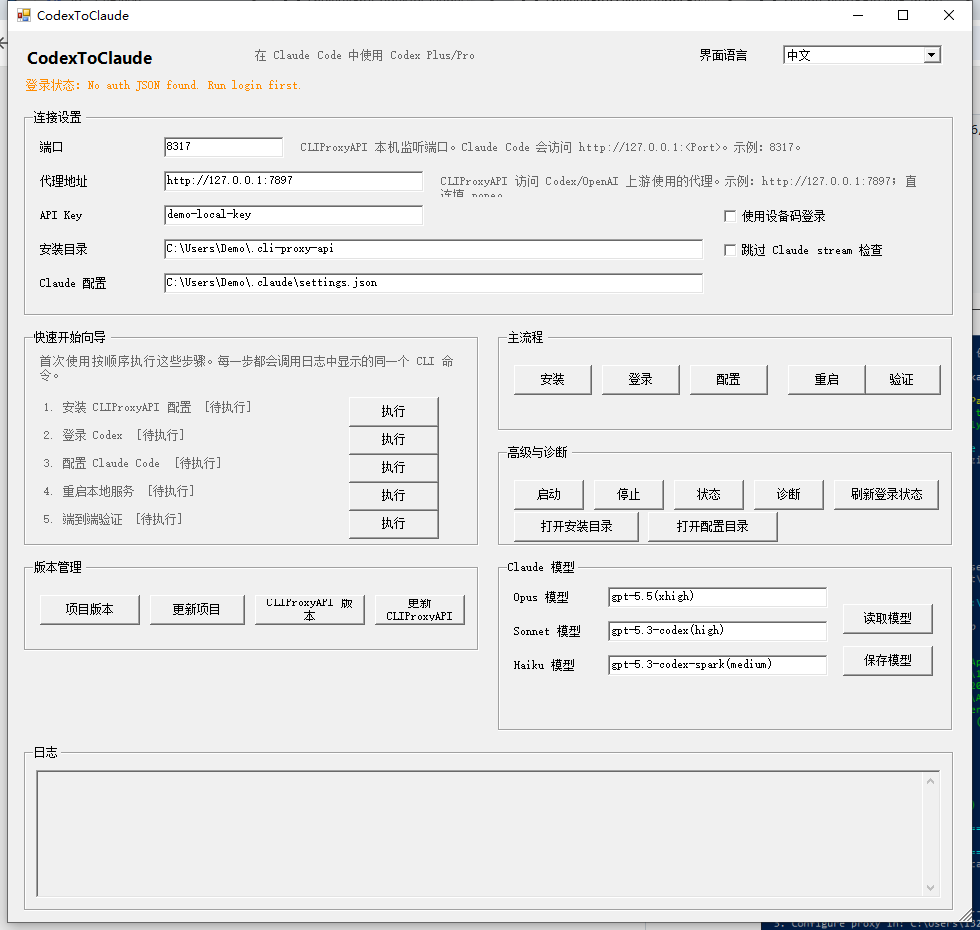

# CodexToClaude

> **C**odex + **C**laude **Code** — 把 Codex 订阅和 OpenCode Go 变成 Claude Code 可用的模型

[](./README.md)
[](https://learn.microsoft.com/en-us/powershell/)
[](./LICENSE)
[](./VERSION)

CodexToClaude 通过本地代理把你的 Codex Plus/Pro 或 OpenCode Go 转换成本机 Anthropic-compatible API，让 Claude Code 直接使用。Windows 优先，GUI 一键操作，支持多后端切换。

```text
Claude Code → http://127.0.0.1:<Port> → CLIProxyAPI → Codex OAuth → Codex models
                                     \-> oc-go-cc    → OpenCode Go models
```

## ✨ 功能

- 🖥️ **GUI 一键操作** — 双击 `CodexToClaude-GUI.cmd`，中文/English 界面切换
- 🔀 **多后端切换** — Codex (Codex Plus/Pro) 和 OpenCode Go 一键切换，无需重启
- 🧙 **快速开始向导** — Install → Login → Configure → Restart → Verify，OCC 后端自动隐藏登录步骤
- 🔐 **OAuth 设备码登录** — Codex 支持设备码登录；OCC 直接在界面输入 API Key
- 🧪 **端到端验证** — `/v1/models`、`/v1/messages` 和 Claude Code stream-json 自动检查；CLIProxy 透传上游限额 headers 供状态栏使用
- 📦 **版本管理** — GUI 内查看/更新项目和后端二进制，无需手动操作
- 🔄 **自动迁移** — 从旧版 `~\.cli-proxy-api` 自动迁移到项目内目录

## 📋 前提

| 条件 | 说明 |
|------|------|
| Codex Plus/Pro 订阅 **或** OpenCode Go API Key | 二选一即可 |
| 代理地址 | 访问上游的代理，直连填 `none` |
| Windows / PowerShell 5.1+ | 主要运行环境 |
| [Git for Windows](https://git-scm.com/) | 项目自更新需要 |
| [Claude Code](https://docs.anthropic.com/en/docs/claude-code) | CLI 或 IDE 集成均可 |

安装前你需要明确两个值：

| 名称 | 说明 | 示例 |
|------|------|------|
| `Port` | 代理本机监听端口。Claude Code 访问 `http://127.0.0.1:<Port>` | `8317`（Codex）/ `3456`（OpenCode Go）|
| `ProxyMode` | 代理模式。`Auto` 可在 HTTP 超时时切换到 SOCKS5；直连选 `Direct` | `Auto` |
| `ProxyUrl` | 访问上游的代理地址。`Auto`/`HTTP`/`SOCKS5` 下填写；直连会忽略此项 | `127.0.0.1:7897` / `socks5://127.0.0.1:7897` |

> ⚠️ 不要在代理模式下留空 ProxyUrl。无代理用户请显式选择 `Direct` 或使用 `none`。

## 🚀 推荐方式：GUI

双击即可：

```text
CodexToClaude-GUI.cmd
```



首次使用按 `Quick start wizard` / `快速开始向导` 顺序执行：

1. 填写 `Port`（如 `8317`），选择 `ProxyMode`（推荐 `Auto`），并填写 `ProxyUrl`（如 `127.0.0.1:7897`；直连选 `Direct`）
2. 依次点击 `Install` → `Login` → `Configure` → `Restart` → `Verify`
3. 若浏览器登录不便，勾选 `Use device login` / `使用设备码登录` 后再执行 `Login`
4. 确认顶部状态显示已登录

### 界面布局

| 区域 | 用途 |
|------|------|
| `Model Source` / `模型来源` | **Codex** / **OpenCode Go** 一键切换，每个后端独立保存端口/目录/模型 |
| `Quick start wizard` | 首次一键配置流程（OCC 后端自动隐藏登录步骤） |
| `Main flow` | 常用按钮（Install / Login / Configure / Restart / Verify） |
| `Claude models` | 修改 Opus / Sonnet / Haiku 模型名，保存后建议 Restart + Verify |
| `Advanced Management` | 项目版本和二进制更新（独立窗口） |
| `Diagnostics` | Start / Stop / Status / Doctor / 刷新登录状态 / 打开目录 |

### Usage limits / 状态栏用量

CodexToClaude 的 CLIProxyAPI 配置会写入 `passthrough-headers: true`，把上游返回的 `X-Codex-Primary-*` 和 `X-Codex-Secondary-*` 限额 headers 透传给 Claude Code 客户端。

这些 headers 可被支持 Codex fallback 的状态栏插件读取，用于显示：

- `5h`：Codex primary window，约 5 小时用量窗口
- `7d`：Codex secondary window，约 7 天用量窗口
- 重置倒计时：根据上游 reset 时间渲染

推荐配合安装 [`cc-statusline`](https://github.com/shuiyu486/terr-marketplace/tree/main/plugins/cc-statusline)，它可以读取 CodexToClaude 透传的 `X-Codex-*` headers，并在状态栏显示 5h/7d usage limits。

注意：CodexToClaude 只负责**透传 headers**；Claude Code 官方的 `rate_limits` 字段是否出现由 Claude Code/上游协议决定。若状态栏插件要在 Codex 后端显示用量，需要插件主动读取这些 `X-Codex-*` headers 或其缓存。

## 🖥️ CLI 用法

### 首次安装（Codex）

```powershell
.\scripts\CodexToClaude.ps1 install -Port 8317 -ProxyMode Auto -ProxyUrl "127.0.0.1:7897"
.\scripts\CodexToClaude.ps1 login
.\scripts\CodexToClaude.ps1 configure -Port 8317 -ProxyMode Auto -ProxyUrl "127.0.0.1:7897"
.\scripts\CodexToClaude.ps1 restart
.\scripts\CodexToClaude.ps1 verify
```

`Auto` 会先按 HTTP 代理写入配置；如果 `verify` 时遇到上游 TLS/timeout 类错误，会自动切换到同地址 `socks5://...`、重启服务并重试。若你明确只想使用某一种协议，可改用 `-ProxyMode Http` 或 `-ProxyMode Socks5`。

### 首次安装（OpenCode Go）

```powershell
.\scripts\CodexToClaude.ps1 install -Provider occ -Port 3456 -ProxyMode Direct -ApiKey "oc-go-cc-..."
.\scripts\CodexToClaude.ps1 configure -Provider occ -Port 3456 -ProxyMode Direct -ApiKey "oc-go-cc-..."
.\scripts\CodexToClaude.ps1 restart -Provider occ
.\scripts\CodexToClaude.ps1 verify -Provider occ
```

### 设备码登录

```powershell
.\scripts\CodexToClaude.ps1 login -Device
```

### 直连网络

```powershell
.\scripts\CodexToClaude.ps1 install -Port 8317 -ProxyMode Direct
.\scripts\CodexToClaude.ps1 configure -Port 8317 -ProxyMode Direct
```

兼容旧写法：`-ProxyUrl none` / `-ProxyUrl direct` 仍会被归一化为直连。

### 日常命令

```powershell
# 检查状态
.\scripts\CodexToClaude.ps1 status
.\scripts\CodexToClaude.ps1 auth-status

# 完整诊断
.\scripts\CodexToClaude.ps1 doctor

# 启停服务
.\scripts\CodexToClaude.ps1 restart
.\scripts\CodexToClaude.ps1 stop
```

### 版本和模型

```powershell
# 查看/更新项目
.\scripts\CodexToClaude.ps1 project-version
.\scripts\CodexToClaude.ps1 project-update

# 查看/更新 CLIProxyAPI
.\scripts\CodexToClaude.ps1 cliproxy-version
.\scripts\CodexToClaude.ps1 cliproxy-update

# 查看/修改模型
.\scripts\CodexToClaude.ps1 models
.\scripts\CodexToClaude.ps1 configure-models -OpusModel "gpt-5.5" -SonnetModel "gpt-5.4" -HaikuModel "gpt-5.4"
```

## 📁 项目结构

```text
CodexToClaude/
├── CodexToClaude-GUI.cmd      ← 双击启动 GUI
├── scripts/
│   ├── CodexToClaude.ps1       ← CLI 主脚本（分发层 + 共享函数）
│   ├── CodexToClaude.UI.ps1    ← WinForms GUI（参数收集 + 步骤编排）
│   └── providers/
│       ├── cliproxy.ps1         ← CLIProxyAPI 后端（Codex OAuth）
│       └── occ.ps1             ← oc-go-cc 后端（OpenCode Go）
├── test/
│   └── Test-CodexToClaude.ps1  ← 自动化测试
├── docs/
│   ├── project-guide.md        ← 维护说明（给 Claude Code 看）
│   ├── claude-code-setup.md    ← 新机器自动配置
│   └── 手动安装与使用.md        ← 不用 CodexToClaude 工具的手动方式
├── cli-proxy-api/              ← CLIProxyAPI 安装目录（git 排除）
├── oc-go-cc/                   ← oc-go-cc 安装目录（git 排除）
├── VERSION                     ← 版本号唯一真源
├── README.md
└── CLAUDE.local.md             ← 项目本地指令
```

## 🔐 认证状态

**Codex 后端**：`Login` 完成后检查 `<repo-root>\cli-proxy-api` 下的 OAuth JSON：

- 是否存在 auth JSON
- 是否为 `type=codex`
- 是否没有 `disabled=true`
- 是否能识别邮箱和过期时间

**OpenCode Go 后端**：检查 `config.json` 中的 `api_key` 或 `OC_GO_CC_API_KEY` 环境变量是否已配置。

**不会打印** `access_token`、`refresh_token`、`id_token`、真实 API key。

### 登录失败？（Codex）

1. 确认代理可用，重新运行 `install/configure -ProxyUrl ...`
2. 改用设备码登录：`login -Device`
3. 确认 OAuth JSON 在 `<repo-root>\cli-proxy-api` 根目录（不在嵌套子目录）
4. 确认 JSON 中 `type=codex` 且没有 `disabled: true`
5. 查看 `<repo-root>\cli-proxy-api\logs\main.log`

## 📝 它会改哪些文件

| 文件 | 用途 |
|------|------|
| `<repo-root>\cli-proxy-api\config.yaml` | CLIProxyAPI 运行配置（Codex 后端） |
| `<repo-root>\cli-proxy-api\cli-proxy-api.exe` | CLIProxyAPI 可执行文件 |
| `<repo-root>\oc-go-cc\config.json` | oc-go-cc 运行配置（OpenCode Go 后端） |
| `<repo-root>\oc-go-cc\oc-go-cc.exe` | oc-go-cc 可执行文件 |
| `<repo-root>\cli-proxy-api\codex-*.json` | Codex OAuth 登录文件 |
| `~/.claude/settings.json` | Claude Code 访问本机代理的 env 配置 |

`settings.json` 只合并更新 `env` 字段，**不会覆盖** `statusLine`、`permissions`、`language` 等现有配置。

## 💭 关于 thinking 输出

CodexToClaude 默认在 CLIProxyAPI config 中写入 payload 过滤：

```yaml
payload:
  filter:
    - models:
        - name: "gpt-*"
          protocol: "codex"
      params:
        - "reasoning"
        - "reasoning.effort"
```

Claude Code TUI 显示 Codex thinking 流时，中文片段可能出现重复字符。过滤 `reasoning` 后，正常回答文本不受影响。

## 🔗 参考项目

CodexToClaude 基于以下开源项目构建：

- [CLIProxyAPI](https://github.com/router-for-me/CLIProxyAPI) — 本地 Anthropic-compatible API 与 Codex OAuth 的代理转换
- [oc-go-cc](https://github.com/samueltuyizere/oc-go-cc) — OpenCode Go 的 Anthropic↔OpenAI 格式转换代理（AGPL-3.0，下载模式集成）

CodexToClaude 提供 Windows 友好的安装、配置、启动、诊断、更新和 GUI 编排。

二进制手动更新：打开对应 Release 页面，下载 Windows x64 / amd64 版本，停止服务后替换对应 exe，再 `restart` + `verify`。

## 🛡️ 安全

禁止提交以下内容：

- Codex OAuth JSON
- `access_token`、`refresh_token`、`id_token`
- 真实 API key
- 日志文件

`.gitignore` 已排除常见敏感文件，提交前仍应检查：

```powershell
git status
git diff
```

## 🧪 开发

```powershell
# 运行测试
.\test\Test-CodexToClaude.ps1

# 真实环境验收
.\scripts\CodexToClaude.ps1 restart
.\scripts\CodexToClaude.ps1 verify
```

详细维护说明见 [`docs/project-guide.md`](docs/project-guide.md)。

## 📄 License

MIT License
