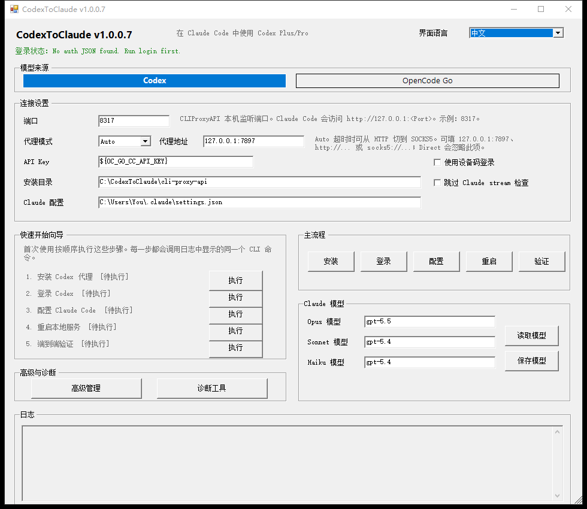
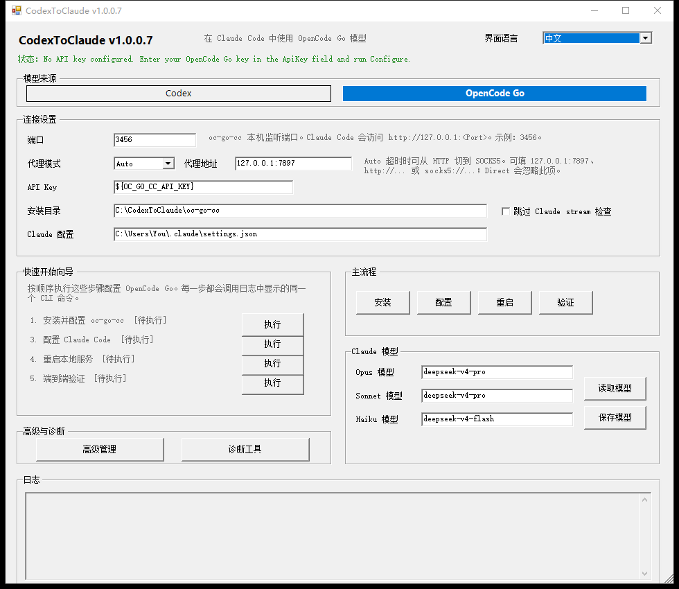

# CodexToClaude

> 把 Codex Plus/Pro 和 OpenCode Go 转成本机 Anthropic-compatible API，让 Claude Code 直接使用。

<p align="center">
  <strong>📖 文档：</strong>
  <a href="./README.md"><strong>English README</strong></a>
  &nbsp;|&nbsp;
  <a href="./README.zh-CN.md"><strong>中文文档</strong></a>
</p>

<p align="center">
  <a href="./README.md"></a>
  <a href="./README.zh-CN.md"></a>
  <a href="https://learn.microsoft.com/en-us/powershell/"></a>
  <a href="./LICENSE"></a>
  <a href="./VERSION"></a>
</p>

## 前言

在使用 cc-switch 及其他类似项目的过程中，我发现它们在 GPT 协议转换与适配方面仍存在一些兼容性问题。这些问题可能会导致 Claude Code 在实际使用中出现请求异常、响应错误或功能不稳定等情况。本项目的目标是针对这些痛点进行改进，提供更加稳定、准确的协议适配方案，使 Codex Plus/Pro 等 GPT 订阅套餐能够在 Claude Code 中正常、流畅地使用。

CodexToClaude 是一个 Windows 优先的本地代理配置工具。它帮你安装、配置、启动和验证后端代理，并自动把 Claude Code 指向本机接口。

```text
Claude Code -> http://127.0.0.1:<Port> -> CLIProxyAPI -> Codex OAuth -> Codex models
                                     \-> oc-go-cc    -> OpenCode Go models
```

## 🎯 适合谁

- 已有 Codex Plus/Pro，希望在 Claude Code 中调用 Codex 模型。
- 已有 OpenCode Go API Key，希望通过 Claude Code 使用 OpenCode Go 模型。
- 不想手动维护代理配置、Claude Code `settings.json`、启动命令和验证流程。

## ✨ 功能亮点

- 🚀 **GUI 向导式安装** — 双击 `CodexToClaude-GUI.cmd`，按向导完成安装、登录、配置、重启、验证。
- 🔀 **双模型来源** — Codex / OpenCode Go 一键切换，不复制业务逻辑。
- 🧩 **自动配置 Claude Code** — 只合并更新 `~/.claude/settings.json` 的目标 `env`，保留 statusLine、permissions、language 等设置。
- 🗜️ **可选自动压缩阈值** — `configure` 可显式写入或删除 Claude Code 自动压缩 env override，用于代理模型上下文窗口被误判的场景。
- 📊 **状态栏用量显示** — 推荐配合安装 [`cc-statusline`](https://github.com/shuiyu486/terr-marketplace/tree/main/plugins/cc-statusline)，它可以读取 CodexToClaude 透传的 `X-Codex-*` headers，并在状态栏显示 5h/7d usage limits。
- 🌐 **内置代理模式** — 支持 `Auto`、`Http`、`Socks5`、`Direct`；`Auto` 可在超时类故障后在 HTTP 和 SOCKS5 之间切换。
- 🧪 **端到端验证** — 自动检查 `/v1/models`、`/v1/messages` 和 Claude Code stream-json。
- 🛟 **卡住恢复 watchdog** — `/v1/messages` 请求超过 60 秒仍未完成时自动重启 CLIProxyAPI；`Auto` 模式会统计近期 HTTP/SOCKS5 卡住次数，并临时固定到更少卡住的一侧。显式 `Http`、`Socks5`、`Direct` 模式不会被自动切换覆盖。
- 🔌 **Codex WebSocket auth 标记** — enabled Codex OAuth JSON 缺少 `websockets` 时自动补 `true`，并保留已有显式值。
- 🧭 **本地代理绕过** — 自动为本地 provider URL 写入 `NO_PROXY` / `no_proxy`，避免 Claude Code 把 `127.0.0.1:<Port>` 请求送进系统代理。
- 🖥️ **命令行代理环境变量** — 诊断工具可把当前代理配置写入用户级 `HTTP_PROXY` / `HTTPS_PROXY` / `ALL_PROXY`，方便新开的 cmd、PowerShell、Git Bash 使用；不会设置 Windows 系统代理或 WinHTTP。
- 📦 **版本管理** — GUI 和 CLI 都能查看/更新项目与后端二进制。
- 🔐 **安全默认值** — OAuth JSON、token、API key、日志均被 `.gitignore` 排除，脚本不会打印真实密钥。

## 🖼️ 界面预览

Codex 后端：



OpenCode Go 后端：



## 📋 安装前准备

| 必需项 | 说明 |
|--------|------|
| Windows / PowerShell 5.1+ | 主支持环境。 |
| Claude Code | CLI、桌面端、IDE 扩展均可。 |
| Codex Plus/Pro 或 OpenCode Go API Key | 两种后端二选一即可。 |
| Git for Windows | 推荐安装，用于项目更新；下载 ZIP 也可以使用。 |
| 可访问上游的网络 | 需要代理时准备一个代理地址，例如 `127.0.0.1:7897`。 |

你还需要决定三个值：

| 名称 | 推荐值 | 说明 |
|------|--------|------|
| `Port` | Codex: `8317`；OpenCode Go: `3456` | Claude Code 访问的本机端口。 |
| `ProxyMode` | `Auto` | 自动先按 HTTP 代理写入，必要时尝试 SOCKS5。 |
| `ProxyUrl` | `127.0.0.1:7897` | `Auto` / `Http` / `Socks5` 必填；直连请选择 `Direct`。 |
| `CodexUserAgent` | 内置 Codex CLI 兼容 UA | 可选 CLI 参数，用作 Codex OAuth 上游请求的 UA fallback；通常不需要改。 |
| `AutoCompact` | `Unset` | 可选 CLI/GUI 设置。`Unset` 不触碰现有 Claude Code 自动压缩 env，`Enabled` 写入 `Window` + `Pct`，`Disabled` 删除这些 override。 |

无代理用户请明确选择 `Direct`，不要把 `ProxyUrl` 留空当作直连。

## 🚀 安装教程：GUI 推荐流程

### 1. 下载项目

任选一种方式：

```powershell
# 方式 A：用 Git 克隆
cd C:\Tools
git clone <your-codextoclaude-repo-url> CodexToClaude
cd .\CodexToClaude
```

或下载项目 ZIP 后解压，例如：

```text
C:\Tools\CodexToClaude
```

如果 Windows 阻止脚本运行，可在项目目录执行：

```powershell
Unblock-File .\CodexToClaude-GUI.cmd
Unblock-File .\scripts\*.ps1
Unblock-File .\scripts\providers\*.ps1
```

### 2. 打开图形界面

双击：

```text
CodexToClaude-GUI.cmd
```

或者在 PowerShell 中运行：

```powershell
.\CodexToClaude-GUI.cmd
```

### 3. 选择模型来源

顶部 `模型来源` 有两个按钮：

| 选择 | 适用场景 |
|------|----------|
| `Codex` | 你有 Codex Plus/Pro，需要 OAuth 登录。 |
| `OpenCode Go` | 你有 OpenCode Go API Key，不需要 OAuth 登录。 |

### 4. 填写连接设置

推荐从这些值开始：

| 字段 | Codex 示例 | OpenCode Go 示例 |
|------|------------|------------------|
| 端口 | `8317` | `3456` |
| 代理模式 | `Auto` | `Auto` |
| 代理地址 | `127.0.0.1:7897` | `127.0.0.1:7897` |
| API Key | 可保持默认本地占位值 | `${OC_GO_CC_API_KEY}` 或你的 OpenCode Go API Key |
| 安装目录 | `C:\CodexToClaude\cli-proxy-api` | `C:\CodexToClaude\oc-go-cc` |
| Claude 配置 | `C:\Users\You\.claude\settings.json` | 同左 |

如果你可以直连上游，把 `代理模式` 改为 `Direct`，此时代理地址会被忽略。

### 5. 按向导执行

#### Codex 后端

在 `快速开始向导` 中依次点击：

```text
安装 Codex 代理 -> 登录 Codex -> 配置 Claude Code -> 重启本地服务 -> 端到端验证
```

登录时会打开浏览器。如果浏览器登录不方便，勾选 `使用设备码登录` 后再点 `登录`；设备码和验证地址会在登录进程等待期间实时输出到 GUI 日志框。

#### OpenCode Go 后端

在 `快速开始向导` 中依次点击：

```text
安装并配置 oc-go-cc -> 配置 Claude Code -> 重启本地服务 -> 端到端验证
```

OpenCode Go 不需要 OAuth 登录。推荐把 API Key 放在环境变量 `OC_GO_CC_API_KEY`，GUI 中保留 `${OC_GO_CC_API_KEY}` 占位即可。

### 6. 验证成功

`验证` 成功后，Claude Code 会通过本机地址访问后端：

```text
http://127.0.0.1:8317   # Codex
http://127.0.0.1:3456   # OpenCode Go
```

此时重启 Claude Code，即可使用 README 中配置的 Opus / Sonnet / Haiku 模型名。

## 🖥️ CLI 安装教程

如果你更喜欢命令行，可以跳过 GUI。

### Codex 首次安装

```powershell
.\scripts\CodexToClaude.ps1 install -Provider cliproxy -Port 8317 -ProxyMode Auto -ProxyUrl "127.0.0.1:7897"
.\scripts\CodexToClaude.ps1 login -Provider cliproxy
.\scripts\CodexToClaude.ps1 configure -Provider cliproxy -Port 8317 -ProxyMode Auto -ProxyUrl "127.0.0.1:7897"
.\scripts\CodexToClaude.ps1 restart -Provider cliproxy
.\scripts\CodexToClaude.ps1 verify -Provider cliproxy
```

设备码登录：

```powershell
.\scripts\CodexToClaude.ps1 login -Provider cliproxy -Device
```

### OpenCode Go 首次安装

```powershell
$env:OC_GO_CC_API_KEY = "你的 OpenCode Go API Key"
.\scripts\CodexToClaude.ps1 install -Provider occ -Port 3456 -ProxyMode Auto -ProxyUrl "127.0.0.1:7897"
.\scripts\CodexToClaude.ps1 configure -Provider occ -Port 3456 -ProxyMode Auto -ProxyUrl "127.0.0.1:7897"
.\scripts\CodexToClaude.ps1 restart -Provider occ
.\scripts\CodexToClaude.ps1 verify -Provider occ
```

### 直连网络

```powershell
.\scripts\CodexToClaude.ps1 install -Port 8317 -ProxyMode Direct
.\scripts\CodexToClaude.ps1 configure -Port 8317 -ProxyMode Direct
.\scripts\CodexToClaude.ps1 restart
.\scripts\CodexToClaude.ps1 verify
```

兼容旧写法：`-ProxyUrl none` / `-ProxyUrl direct` 会被归一化为直连。

### 可选 Claude Code 自动压缩阈值

如果 Claude Code 误判代理模型的上下文窗口，可以在 `configure` 时显式配置自动压缩 override：

```powershell
.\scripts\CodexToClaude.ps1 configure -Provider cliproxy -Port 8317 -ProxyMode Auto -ProxyUrl "127.0.0.1:7897" -AutoCompact Enabled -AutoCompactWindow 120000 -AutoCompactPct 70
```

`Enabled` 必须同时提供两个值。`Disabled` 会删除 `CLAUDE_CODE_AUTO_COMPACT_WINDOW` 和 `CLAUDE_AUTOCOMPACT_PCT_OVERRIDE`；`Unset` 不触碰已有值。实际压缩触发时机仍由 Claude Code 控制，只能视为近似阈值。

## ⚙️ 常用命令

```powershell
# 查看状态
.\scripts\CodexToClaude.ps1 status
.\scripts\CodexToClaude.ps1 auth-status

# 完整诊断
.\scripts\CodexToClaude.ps1 doctor

# 可选高级兼容检查
.\scripts\CodexToClaude.ps1 verify -CheckToolSearch

# 启停服务
.\scripts\CodexToClaude.ps1 start
.\scripts\CodexToClaude.ps1 stop
.\scripts\CodexToClaude.ps1 restart

# 查看/更新项目
.\scripts\CodexToClaude.ps1 project-version
.\scripts\CodexToClaude.ps1 project-update

# 查看/更新当前 provider 二进制
.\scripts\CodexToClaude.ps1 cliproxy-version
.\scripts\CodexToClaude.ps1 cliproxy-update

# 查看/修改 Claude Code 模型映射
.\scripts\CodexToClaude.ps1 models
.\scripts\CodexToClaude.ps1 configure-models -OpusModel "gpt-5.5" -SonnetModel "gpt-5.4" -HaikuModel "gpt-5.4"
```

## 📁 目录和文件说明

CodexToClaude 会创建或修改这些文件：

| 路径 | 用途 |
|------|------|
| `<repo-root>\cli-proxy-api\config.yaml` | CLIProxyAPI 配置。 |
| `<repo-root>\cli-proxy-api\cli-proxy-api.exe` | CLIProxyAPI 可执行文件。 |
| `<repo-root>\cli-proxy-api\codex-*.json` | Codex OAuth 登录文件，已被 git 排除。 |
| `<repo-root>\cli-proxy-api\codextoclaude-state\watchdog-state.json` | CodexToClaude watchdog 的 Auto 代理状态；不放在 auth-dir 根层，避免干扰 credential 扫描。 |
| `<repo-root>\oc-go-cc\config.json` | oc-go-cc 配置。 |
| `<repo-root>\oc-go-cc\oc-go-cc.exe` | oc-go-cc 可执行文件。 |
| `~\.claude\settings.json` | Claude Code 的环境变量配置。 |

项目结构：

```text
CodexToClaude/
├── CodexToClaude-GUI.cmd      # 双击启动 GUI
├── scripts/
│   ├── CodexToClaude.ps1      # CLI 主入口
│   ├── CodexToClaude.UI.ps1   # WinForms GUI
│   └── providers/
│       ├── cliproxy.ps1       # Codex / CLIProxyAPI provider
│       └── occ.ps1            # OpenCode Go / oc-go-cc provider
├── docs/
│   ├── assets/                # README 截图
│   ├── claude-code-setup.md   # 新机器配置说明
│   ├── project-guide.md       # 维护者说明
│   └── 手动安装与使用.md       # 手动配置参考
├── test/
│   └── Test-CodexToClaude.ps1
├── VERSION
└── README.md
```

## 🧯 故障排查

| 问题 | 处理方式 |
|------|----------|
| GUI 打不开 | 在项目目录执行 `Unblock-File`，或用 PowerShell 运行 `powershell -ExecutionPolicy Bypass -File .\scripts\CodexToClaude.UI.ps1`。 |
| Codex 登录失败 | 检查代理；重新运行 `install/configure`；尝试 `login -Device`；查看 `cli-proxy-api\logs\main.log`。 |
| OpenCode Go 提示没有 API Key | 设置环境变量 `OC_GO_CC_API_KEY`，或在 GUI 的 API Key 输入框填写后点击 `配置`。 |
| `verify` 超时或 TLS 错误 | `ProxyMode Auto` 会尝试从 HTTP 切换到 SOCKS5；Codex auth JSON 缺少 `websockets` 时会自动补 `true`。如果多次 `/v1/messages?beta=true` 仍超时，建议显式使用 `Socks5` 并保持 watchdog 开启。显式 `Socks5` 会固定为 SOCKS5；watchdog 只重启卡住请求，不会切回 HTTP。 |
| `verify` 报 403 / 已禁止，且错误日志包含 `Enable JavaScript and cookies to continue` | 这是 `chatgpt.com/backend-api/codex/responses` 返回的 Cloudflare challenge。当前配置会写入 `codex-header-defaults.user-agent` 作为 Codex OAuth 上游 UA fallback；如果仍失败，通常是当前网络或代理出口被风控，换一个代理出口或网络后重新执行 `配置` + `重启` + `验证`。 |
| Claude Code 报 socket closed 或本地代理 502 | 重新执行 `配置`，确保 `NO_PROXY` / `no_proxy` 包含 `127.0.0.1:<Port>`，然后重启 Claude Code。快速上游 5xx 交给 Claude Code 自身重试；watchdog 只处理长时间卡住请求。 |
| Claude Code 仍访问旧模型 | 先点 `配置`，再点 `重启`，然后重启 Claude Code 客户端。 |
| 端口被占用 | 换一个端口，并重新执行 `配置` + `重启` + `验证`。 |

## 📊 用量状态栏

Codex 后端会在 CLIProxyAPI 配置中启用 `passthrough-headers: true`，把上游返回的 `X-Codex-Primary-*` 和 `X-Codex-Secondary-*` 限额 headers 透传给 Claude Code 客户端。

如果你的状态栏插件支持读取这些 headers，就可以展示：

- 约 5 小时窗口的 primary usage limit。
- 约 7 天窗口的 secondary usage limit。
- 对应 reset 倒计时。

推荐配合安装 [`cc-statusline`](https://github.com/shuiyu486/terr-marketplace/tree/main/plugins/cc-statusline)，它可以读取 CodexToClaude 透传的 `X-Codex-*` headers，并在状态栏显示 5h/7d usage limits。


CodexToClaude 只负责透传 headers，不负责状态栏渲染。

## 💭 关于 thinking 输出

CodexToClaude 默认会把 `reasoning` / `reasoning.effort` / `thinking` 透传给 CLIProxyAPI，让后端跟随 Claude Code 当前 `/effort` 或 `effortLevel`，而不是把思考强度写死为 max。

如果 Codex thinking 流导致中文重复字符、thinking 输出过长或其它 TUI 展示异常，可以手动在 `cli-proxy-api/config.yaml` 中加入下面的兼容过滤配置，然后重启 CodexToClaude。这样会关闭匹配 Codex 模型的这些思考相关请求字段。

```yaml
payload:
  filter:
    - models:
        - name: "gpt-*"
          protocol: "codex"
      params:
        - "reasoning"
        - "reasoning.effort"
        - "thinking"
```

## 🛡️ 安全提醒

不要提交或公开这些内容：

- Codex OAuth JSON。
- `access_token`、`refresh_token`、`id_token`。
- 真实 OpenCode Go API Key。
- 日志文件。

提交前建议检查：

```powershell
git status
git diff
```

## 🧪 开发与测试

```powershell
# 运行自动化测试
.\test\Test-CodexToClaude.ps1

# 真实环境验收
.\scripts\CodexToClaude.ps1 restart
.\scripts\CodexToClaude.ps1 verify
.\scripts\CodexToClaude.ps1 verify -CheckToolSearch
```

更详细的维护约定见 [`docs/project-guide.md`](docs/project-guide.md)。

## 🔗 参考项目

CodexToClaude 基于以下开源项目构建：

- [CLIProxyAPI](https://github.com/router-for-me/CLIProxyAPI)：本地 Anthropic-compatible API 与 Codex OAuth 的代理转换。
- [oc-go-cc](https://github.com/samueltuyizere/oc-go-cc)：OpenCode Go 的 Anthropic / OpenAI 格式转换代理。

## 📄 License

MIT License
